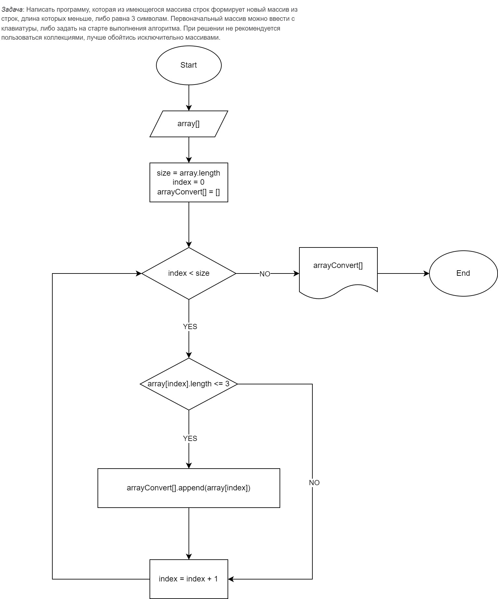

# Контрольная работа

## Задача
Написать программу, которая из имеющегося массива строк формирует новый массив из строк, длина которых меньше, либо равна 3 символам. Первоначальный массив можно ввести с клавиатуры, либо задать на старте выполнения алгоритма. При решении не рекомендуется пользоваться коллекциями, лучше обойтись исключительно массивами.

## Решение
Для решения этой задачи мы используем простой алгоритм, который проходит по каждой строке исходного массива и проверяет её длину. Если длина строки меньше или равна 3 символам, она добавляется в новый массив. Таким образом, мы получаем массив только с нужными строками.

## Блок-схема алгоритма


## План решения:
* **Инициализация**: Создать массив строк.
* **Инициализация массива результатов**: Создать пустой массив, который будет хранить отфильтрованные строки.
* **Фильтрация строк**: Пройти по каждой строке исходного массива.
Если длина текущей строки меньше или равна 3 символам, добавить эту строку в массив результатов.
* **Вывод результатов**: Вывести на экран отфильтрованный массив строк

## Псевдокод
```sh
# Создаем массив строк
array = ["apple", "banana", "car", "dog", "elephant", "fox"]

# Создаем пустой массив для хранения отфильтрованных строк
convert_array = []

# Проходим по каждой строке исходного массива
for string in array:
    # Проверяем длину строки
    if len(string) <= 3:
        # Если длина строки меньше или равна 3 символам, добавляем её в отфильтрованный массив
        convert_array.append(string)

# Выводим отфильтрованный массив строк
print(convert_array)
```

